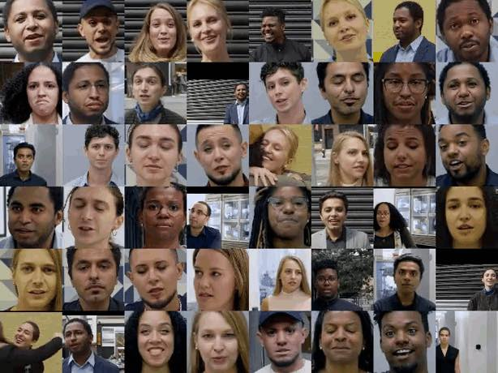

# Fake-Detection-dataset-for-deepfake-from-Google-and-Jigsaw

Fake Detection dataset for deepfake from Google and Jigsaw. A bold effort to mitigate potential harms from misuses of synthetic media.
Deepfakes are produced by deep generative models that can manipulate video and audio clips.

Google deepfake dataset is released in the FaceForensics benchmark providing best practices to mitigate the potential for harm and abuse.

Paper: https://arxiv.org/pdf/1901.08971.pdf
Dataset: https://github.com/ondyari/FaceForensics/tree/master/dataset
